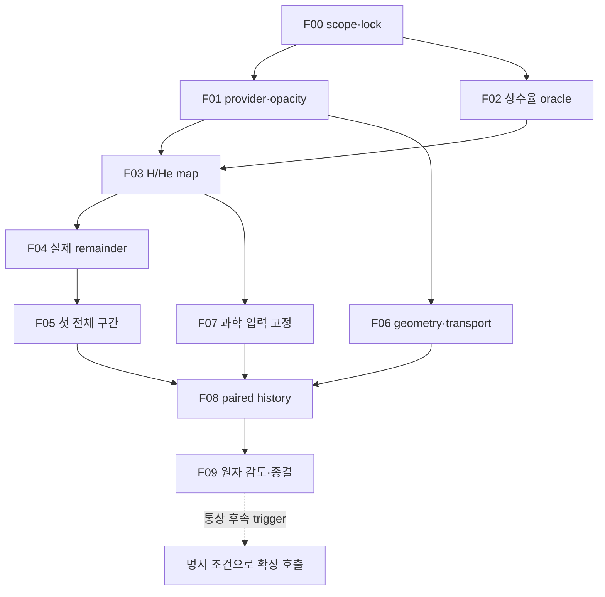

# rei_bianchi — 외부 원자 입력으로 첫 재이온화 결과까지

이 문서의 결정은 2026-10-04 현재 읽은 `forward/rust-reion-kernels-20260922` commit `0100b1dfa023928d67602877876b586fea319d13`에 대한 것이다. 새 branch를 요구하지 않는다. 같은 branch의 논리적 PR 단위로 분할하고, 이미 열린 해당 head PR이 있다면 그 PR을 갱신한다. 이번 read-only 조회에서는 해당 head의 open PR이 0개였다(`open_prs.json`). 최종 게시 직전 상태는 publisher receipt를 따른다.

## 목표·완료 기준

원자 ab-initio 완료를 기다리지 않고 (a) source-pinned public H/He 입력, (b) 실제 Rust 열화학 map, (c) unchanged numerical gates의 첫 전체 구간, (d) FLRW/Bianchi-I paired history를 만든다. 첫 scientific output은 x_HII, x_HeII, x_HeIII, T, Γ_s, photoheating 및 기하 차이다. 논문 production/관측 제약/CAMB 결과는 이 최초 완료 기준 밖이다.

이번 채팅에서 끝낸 선행연구는 `PREWORK_KO.md`다. 결정하지 않은 것을 완료처럼 둔 것이 아니라 다음 실행 경계를 분리했다. 문헌을 다시 전수 조사하지 않고, 고정 source의 정확한 계수/단위/도메인 검사를 coding task로 수행한다. 실행 전 exactprovider admission은 아직 안 됐다.

## 읽은 실제 경로와 새 제안 경로

| 구분 | 실제 읽은 경로 | 발견·의미 |
|---|---|---|
| observed | `rust/rei_microphysics/src/lib.rs` | state는 4-group count와 scalar matter; angular fγ 없음 |
| observed | `rust/rei_microphysics/src/group_rates.rs` | lowgroup effective HI opacity 소유권; R1 homogeneous opacity와 다른 closure |
| observed | `rust/rei_microphysics/src/coverage.rs` | 외부 physical source 모두 거절 |
| observed | `rust/rei_microphysics/src/joint_affine.rs` | 제공된 affine coefficients/remainders의 결합만 인증 |
| observed | `docs/forward/RUST_JOINT_PARENT_AND_JAX_RETIREMENT_20260930.md` | 실제 nonlinear map 미인증, Python/JAX retired |
| observed | `docs/forward/RUST_MICROSTEP_DEVELOPMENT_READY_20260930.md` | 최초 interval 실패·엄격 gate·H fixed-rate oracle 요구 |
| observed | `handoff/CURRENT_HANDOFF_PROMPT.md` | 원 프로그램·후속 geometry/REC/CAMB gate |
| proposed | `src/atomic_provider.rs`, `src/homogeneous_rates.rs` | 새 public rates와 R1-only opacity adapter |
| proposed | `src/hhe_events.rs`, `src/thermal.rs`, `src/microstep.rs` | 실제 all-H/He 이벤트 및 implicit coupled map |
| proposed | `src/validated_map.rs`, `src/adaptive_history.rs` | 공동 parent 증명과 첫 구간 트랜잭션 |
| proposed | `src/bianchi_i.rs`, `src/angular_photons.rs` | fγ angle-energy 수송 및 exact geometry |

proposed의 `src/`는 `rust/rei_microphysics/` 아래다. 이 경로/CLI가 이미 존재한다는 의미가 아니다. TASKS의 outputs가 만들어진 뒤에만 해당 target 명령을 실행한다. `coverage.rs`의 기존 fail-closed API를 일괄 해제하지 않는다.

## PR 단위와 순서

| 논리 PR ID | task | 변화·결과 | 완료 증거 |
|---|---|---|---|
| REI-PR00 | F00 | successor model/input lock, closure와 source authority 구분 | source drift bounded diff·선택 기록 |
| REI-PR01 | F01 | Grackle/Verner provider, homogeneous opacity, type/unit/domain | original code/formula 대조·기존 7 API 회귀 |
| REI-PR02 | F02 | 상수율 H exact oracle·분리 event counts | pure/mixed/zero/underflow-safe tests |
| REI-PR03 | F03 | H/He photon/energy coupled map·완전히 지정된 toy fixture | nuclei/charge/energy + independent solve·refinement |
| REI-PR04 | F04 | sparse 공동-parent 실제 nonlinear remainder | independent checker·실제 parent·applicable lanes/sites |
| REI-PR05 | F05 | full first interval adaptive commit/reject | strict gate와 전체 interval receipt |
| REI-PR06 | F06 | Bianchi I geometry/angular transport | exact geodesic·isotropic limit·conservation |
| REI-PR07 | F07 | 첫 science scenario와 secondary/tail approximation 사전등록 | 입력 전체 수치화·domain/tail 판정 |
| REI-PR08 | F08 | paired FLRW/Bianchi histories | curve data, numerical/model/atomic ledger |
| REI-PR09 | F09 | HH/HE 공개 provider 감도·응용 종결 | 같은 realization 쌍·관측량 감도표 |

이는 생성된 GitHub PR 번호가 아니다. 한 기존 head branch에서 연속 commit을 쌓으므로 실제 PR은 publication/integration 목적의 하나를 갱신할 수 있다. main으로 자동 merge하지 않는다. 논리 PR마다 scope가 좁으므로 저비용 LLM이 변경파일·검증명령을 곧바로 찾을 수 있다.



F01/F02는 병렬 가능하고, F06의 **isolated** geometry tests는 F04/F05와 병렬 가능하다. F06이 먼저 끝나도 coupled Bianchi science는 F05 이전에 활성화하지 않는다. HH/HE/CR 스레드의 공개 provider 설계는 병렬이다. 내부 K/289-cell/B5C 정밀곡선은 이 DAG 선행조건이 아니다.

장기 lane L01은 F09 완료를 기다리지 않는다. 명시 사용자 호출 또는 실제 dependency/domain/감도 문제가 생기면 해당 확장의 필요한 선행자료만 지정해 활성화한다. 예컨대 F07에서 REC 입력이나 secondary deposition이 필요하다고 판단하면 F08/F09 전에도 그 확장을 호출한다. F09는 통상 후속 trigger 중 하나이며 강제 dependency가 아니다.

F09의 cross-repo prerequisite는 HH-F2와 HE-F2의 consumer binding이다. **rei_bianchi만 combined paired sensitivity campaign을 한 번 실행**하고 `docs/atomic_reionization_handoff_20261004_v1/runtime_outputs/paired_atomic_sensitivity_v1.json`을 반환한다. HH-F3/HE-F3는 그 결과를 검토·수락하며 별도 cosmological campaign을 중복 실행하지 않는다. optional He emission ledger가 준비되지 않으면 F09만 조건부 대기한다. 선언된 process model 안에서의 baseline F08 결과까지 차단하지 않는다.

## 바로 실행할 명령

repository root에서 먼저 변경사항을 보존하고 현재 ref를 확인한다. docs-only 새 게시 commit은 기준 코드 commit이 오래되었다는 이유로 되돌리지 않는다.

```bash
git status --short
git branch --show-current
git rev-parse HEAD
git diff 0100b1dfa023928d67602877876b586fea319d13 -- rust/rei_microphysics
cargo fmt --manifest-path rust/rei_microphysics/Cargo.toml --all -- --check
cargo test --manifest-path rust/rei_microphysics/Cargo.toml --workspace --locked
cargo clippy --manifest-path rust/rei_microphysics/Cargo.toml --workspace --all-targets --locked -- -D warnings
python scripts/verify_repo.py
```

위 cargo/verify 명령은 실제 README에 있는 명령이다. 본 채팅에서는 실행하지 않았다. targeted commands와 proposed output은 TASKS.json의 각 작업에 있다. 이미 완료한 synthetic joint-affine fixture를 다시 구현하는 작업은 없다. 아직 없는 `hydrogen_step`, `hhe_fixture`, `validated_map`를 순서대로 구현한다.

작업 완료 receipt에는 `task_id, base_commit, result_commit, source_manifest_sha256, commands, exit_codes, artifacts, scientific_claim, untouched_gates, failures, next_ready_task`를 담는다. 실행환경 실패는 해당 명령과 stderr를 기록하고 수학·물리 실패로 치환하지 않는다. 미충족 gate는 분명히 남긴다. 전체재감사를 반복하지 말고 처음 실패한 source/domain/event/map component로 범위를 좁힌다.

## 오류 예산과 gate

기존 과거 [160,161]은 E_logT=2.1245050576368385e−4로 strict <2e−4를 실패했다. 새 judge가 올바르게 인증되더라도 이 기록은 변경하지 않는다. 새 map의 threshold도 local <2e−4, public width <2e−3를 유지한다. parent dimension은 실제 successor에 맞춰 F00에서 고정한다. 46,080-node/3-shape-lane 조건은 inherited NodeHistory를 이어갈 때 적용되며 새 homogeneous map의 성공으로 그 원 gate를 닫지 않는다. float function parity, derivative/remainder enclosure, atomic physical uncertainty, SED/closure model error는 서로 다른 열이다.

Grackle floor와 piecewise branch는 데이터 정확도의 보증구간이 아니다. source code를 그대로 가져왔다는 사실만으로 Hessian bound가 생기지 않는다. 기저 normalization이나 wavefunction phase 문제는 scalar rate 공급과 관련된 consumer 요청이 있을 때만 원자 정밀 lane을 호출한다.

## 세 원자 스레드에서 받는 최소 계약

| sender | fast input | 이 소비자의 수락 | 장기 회귀 연결 |
|---|---|---|---|
| WU088_HH | process별 rate convention·LCS/corrected KS sensitivity choices | k57 event convention, domains, thermal energy bookkeeping | hot gas/21 cm/non-Maxwell일 때 elastic/spin/precision 요청 |
| BASS_HE | KF96 nominal prescription·RCT/NRCT 구별·energy release | approximate flag·emitted photon owner·sensitivities | 관측량이 지배되거나 state-selective 채널일 때 정밀곡선 요청 |
| bass_cr | CR-off baseline statement·CR-on process providers | 기본 0 CR; CR-on에서 fast/thermal particle bookkeeping | deposition/momentum 필요시 original K 또는 외부 differential source 요청 |

첫 R1 물리 입구는 표준 H/He다. HeCX와 HH는 on/off/대안 계수 결과를 기록한 뒤 '응용 공급 완료'를 선언한다. 단순히 task를 게시하거나 후보 formula를 찾았다는 이유로 세 원자 스레드의 응용 gate를 닫지 않는다. 원래 atomic precision 연구는 legacy lane으로 언제든 호출할 수 있고, 새 Provider trait·event ledger를 regression target으로 삼아 같은 소비자에 붙는다.

## 재사용·백업

`legacy_sources/MANIFEST.json`의 원 Git commit/path/blob SHA 및 SHA-256로 원계획·R1 계약·현재 numerical gate/source 실물을 복원할 수 있다. 이는 선별된 source snapshot 백업이며 전체 저장소 history mirror나 과거 실행환경 restore 검증은 아니다. 변경한 fast-track 파일과 source bundle의 GitHub/Drive/Dropbox 최종 identity는 최상위 publication receipt를 따른다.
