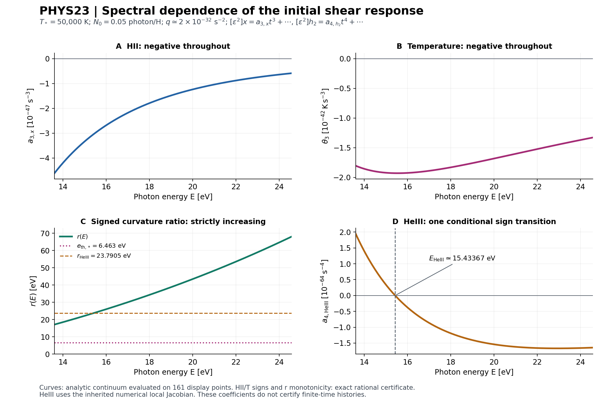

# REI-PHYS23 — 초기 shear 응답의 에너지·스펙트럼 부호

**연구 루프:** SPECTRAL_INITIAL_RESPONSE_AND_THERMAL_SIGN  
**작성일:** 2026-10-10 · **모델:** GPT-6 Astra · **하네스:** Astra v4.0.0  
**과학 입력:** PHYS22의 닫힌 초기시간 식과 현재 branch의 동일한 원자·기체 소스  
**최종 판정의 권위:** [독립 decision review](independent/DECISION_REVIEW.json). 이 보고서는 그 판정이 읽는 고정 과학 후보이며, owner의 자체 승격 기록이 아니다.

## 1. 이번 루프가 닫은 질문

실제 초기 기체 \(T_*=50000\,\mathrm K\), \(x_{\mathrm{HII},*}=0.9\), \(h_{1,*}=0.3\), \(h_{2,*}=0.6\)를 유지하고, HI만 직접 광이온화하는 에너지 구간에서 초기 shear response의 부호를 분류했다. 결과는 다음과 같다.

1. 실제 HI fit의 열린 구간 \((\operatorname{f64}(13.60),\operatorname{f64}(24.59))\,\mathrm{eV}\) 전체에서 HII, 열에너지/H, 온도의 \(\epsilon^2t^3\) 계수는 모두 음수다. 세 함수의 영점 수는 각각 0이다. 유리수 다항식의 exact Bernstein certificate가 이 결론을 지지한다.
2. 비영인 양의 photon-number spectrum의 support가 이 구간 안의 compact set에 있으면, 스펙트럼을 섞어도 세 음의 부호가 유지된다. 필요한 평균은 일반적인 평균 광자 에너지가 아니라 응답 계수로 가중한 비 \(R_\nu\)다.
3. HeIII의 간접 \(\epsilon^2t^4\) 계수는 같은 spectral map에서 부호가 바뀐다. PHYS22에서 고정한 수치 \(J_{\rm np,*}\)에 조건부로, 전환 에너지는 약 \(15.43367086782694\,\mathrm{eV}\)다. 단조성 증명은 영점이 많아야 하나임을 주며, 수치 bracket은 그 영점이 존재함을 지지한다.
4. 같은 총 광자 수와 같은 총 에너지를 가진 두 스펙트럼에서 HeIII \(t^4\) 계수의 부호가 반대인 반례를 구성했다. 따라서 이 응답을 평균 에너지의 monoenergetic 값으로 대체하는 것은 일반적으로 성립하지 않는다.

이것은 초기시간의 국소 계수에 관한 결과다. 유한시간 기체 궤적, Taylor remainder의 수치 상계, native binary arithmetic의 동등성, 물리적 실행 구간의 통과를 뜻하지 않는다. Physical admission은 HOLD다.

## 2. 입력 identity와 연구 계약

저장소는 cosmosapjw-quantum/rei_bianchi, branch는 forward/rust-reion-kernels-20260922, 기존 [draft PR83](https://github.com/cosmosapjw-quantum/rei_bianchi/pull/83)이다.

| 항목 | 고정 값 |
|---|---|
| PHYS23 input commit | e334866a4ac1be963f573c0b35182d25eb4d666b |
| Input root tree | 05afdbe0aaee3f67f42ea3f1cdf946238faaf3e7 |
| Scientific Rust src tree | cb69b4736dd046e4675557577eb8e0ead037d1f3 |
| PHYS23 계약 SHA256 | 888eb11c8a53f828b0ed5d3a053d91dc4da671d727e49c519cb3110bb5b6d200 |
| PHYS22 coefficient JSON SHA256 | 6c7a4f239ef48c2a7c60592fc048600317f1233f3028434ebd1b3c7e55682a79 |
| 복원한 PHYS22 archive SHA256 | d34929138647861cb4d6bdd57236feebd3f4f7ca25b2c863c0beace5270ab673 |
| Canonical Astra harness SHA256 | dae76c90f2e5d691bcdd595dadbe470bacacba3bb2a036ff9788ffe7d3bfabb7 |

현재 세션의 빈 작업 공간에 직전 완성 PHYS22 묶음을 복원했다. Archive SHA/CRC와 64개 payload의 일치를 한 번 확인했고, 현재 완전한 remote tree의 source blob 7개와 복원한 파일이 일치했다. 이는 WORKSPACE_REHYDRATION이며, 미완성 과학 실행의 runtime interruption으로 기록하지 않았다. PHYS22 과학 프로그램은 실행하지 않았다.

[고정 계약](PHYSICS_CONTRACT.json), [source manifest](SOURCE_MANIFEST.json), [재수화 기록](evidence/INPUT_REHYDRATION.json), [remote input identity](evidence/REMOTE_INPUT_IDENTITY.json)가 입력 근거다. Source manifest에 남아 있던 PHYS22 task 표기는 별도 reviewer가 발견하여 PHYS23으로 수정했다. 원본과 수정 내역을 보존했으며 source bytes나 과학식은 바뀌지 않았다.

## 3. 물리 convention과 관측량

\[
F_\epsilon(t)=F_0(t)+\epsilon^2F_2(t)+o(\epsilon^2),\qquad
F_2=\tfrac12\partial_\epsilon^2F_\epsilon|_{\epsilon=0},
\]
\[
B(t)=t\Sigma,\qquad
\Sigma=\varsigma\,\operatorname{diag}(1,-1,0),\qquad
q=\operatorname{tr}\Sigma^2=2\varsigma^2.
\tag{1}
\]

Metric은 \((-+++)\), 시간은 기체와 함께 움직이는 proper seconds, 에너지는 eV다. 기체 상태는 \(y=(x,h_1,h_2,w)\), \(w\)는 eV/H다. HII는 수소 중의 이온화 분율, \(h_1,h_2\)는 헬륨 중의 HeII·HeIII 분율이다.

\[
x_2(t)=a_{3,x}t^3+O(t^4),\quad
w_2(t)=a_{3,w}t^3+O(t^4),\quad
T_2(t)=\theta_3t^3+O(t^4),
\]
\[
(h_1,h_2)_2(t)=(a_{4,h_1},a_{4,h_2})t^4+O(t^5).
\tag{2}
\]

계수에는 이미 physical \(q\)가 들어 있다. \(t^3,t^4\)에 추가 factorial을 붙이지 않으며 \(\epsilon^2\)를 다시 곱한 결과와 계수 자체를 구분한다. 식 (2)의 remainder 크기를 이번 루프에서 구하지 않았다.

실제 입력은 \(H=10^{-14}\,\mathrm{s}^{-1}\), \(n_H=10^{-4}\,\mathrm{cm}^{-3}\), \(f_{\rm He}=0.083\), \((x,h_1,h_2,T)=(0.9,0.3,0.6,50000\,\mathrm K)\), \(N_0=0.05\) photon/H다. \(\varsigma=(\operatorname{f64}(1.01e{-14})-\operatorname{f64}(0.99e{-14}))/2\)여서 \(q\simeq1.9999999999999703\times10^{-32}\,\mathrm{s}^{-2}\)다. Production birth rate \(S=5\times10^{-15}\) photon \(\mathrm H^{-1}\mathrm{s}^{-1}\)와 energy 13.7 eV는 변경하지 않았다.

\[
\Pi_*=1+f_{\rm He}+x_*+f_{\rm He}(h_{1,*}+2h_{2,*})\simeq2.1075,
\quad
\mathcal A_T=\frac{2e_{\rm V}}{3k_B},
\quad
e_{\rm th,*}=\frac{3k_BT_*}{2e_{\rm V}}
\simeq6.462999946608883\,\mathrm{eV}.
\tag{3}
\]

\(k_B=1.380649\times10^{-16}\,\mathrm{erg/K}\), eV→erg 변환은 \(1.602176634\times10^{-12}\)를 실제 source binary64 literal의 exact-real 값으로 해석했다. 이는 매 연산을 native f64로 반올림하는 모델이 아니다. PHYS22와 같이 continuum의 \(T_*=50000\) K 정규화를 사용하며, native 초기 \(w\)를 역변환한 49999.99999999999 K와의 미세한 차이를 native 동등성으로 해소했다고 주장하지 않는다.

주 계산 구간은 exact decimal \([13.61,24.58]\) eV다. 모든 부호 증명은 더 큰 열린 HI-only 구간으로 확장된다. 진단용 에너지는 exact decimal이고, 기존 13.7 eV anchor만 source binary64 13.7을 사용했다.

## 4. PHYS22에서 계승한 선도 spectral functional

초기 광자 분포를 유한 양의 photon-number measure \(d\nu_0(E)\)로 쓴다. \(\nu_0(I)=N_0\)가 첫 정규화다. 에너지에 대한 단일선·유한 혼합·연속 분포를 모두 포함한다. 각 family는 초기 각분포가 등방적이고 \(\epsilon\)에 독립적이다.

\[
D=E\partial_E,\qquad \mathscr C=D(D+3),\qquad
\lambda(E)=c\,n_H(1-x_*)\sigma_{\rm HI}(E).
\tag{4}
\]

\(D\)는 초기 기체 상태를 고정하고 관측 kernel에 작용한다. 다음은 이번 루프의 새 증명이 아니라 PHYS22에서 닫힌 입력이다.

\[
a_{3,x}=\frac q{45}\int \mathscr C\lambda(E)\,d\nu_0(E),
\quad
a_{3,w}=\frac q{45}\int
\mathscr C[\lambda(E)(E-\chi)]\,d\nu_0(E),
\tag{5}
\]
\[
\theta_3=\frac q{45}\frac{\mathcal A_T}{\Pi_*}
\int\mathscr C\{\lambda(E)[E-\chi-e_{\rm th,*}]\}\,d\nu_0(E).
\tag{6}
\]

\(\chi=\operatorname{f64}(13.598434599702)\) eV는 에너지 전달에 쓰는 물리 threshold이며 opacity cutoff \(\operatorname{f64}(13.60)\) eV와 다르다. 식 (6)의 \(-e_{\rm th,*}\)는 이온화로 자유입자 수가 변하는 온도 항이다. 이를 빼면 다른 thermal sign problem을 풀게 된다.

He photo weights는 이 support에서 0이고 \(a_{3,h_1}=a_{3,h_2}=0\)이므로

\[
a_{4,h_i}=\frac14(J_{\rm np,*}a_3)_{h_i},\qquad i=1,2.
\tag{7}
\]

닫힌 \(J_{\rm np,*}\)의 serialized Decimal80 값은 [PHYS22_INITIAL_COEFFICIENTS.json](inputs/PHYS22_INITIAL_COEFFICIENTS.json)에서 읽었다. 기존 Jacobian 유도나 gas IVP를 반복하지 않았다.

## 5. 실제 HI fit의 로그 기울기 환원

실제 [atomic_provider.rs](inputs/pinned_source/rust/rei_microphysics/src/atomic_provider.rs)의 HI branch에서

\[
X=\frac E{E_0},\qquad z=\sqrt{\frac{X}{y_a}},
\]
\[
\sigma(E)=\sigma_0\,u_{\rm mb}(X-1)^2
X^{P/2-11/2}(1+z)^{-P},
\tag{8}
\]

\(E_0=\operatorname{f64}(0.4298)\) eV, \(y_a=\operatorname{f64}(32.88)\), \(P=\operatorname{f64}(2.963)\), \(\sigma_0=\operatorname{f64}(5.475e4)\), \(u_{\rm mb}=\operatorname{f64}(1e{-18})\,\mathrm{cm}^2\)다. 양의 normalization은 부호에서 소거되지만 실제 계수 계산에는 유지했다.

\[
\begin{aligned}
\alpha=D\log\sigma
&=-\frac72+\frac2{X-1}+\frac{P}{2(1+z)},\\
\beta=D\alpha
&=-\frac{2X}{(X-1)^2}-\frac{Pz}{4(1+z)^2},\\
A&=\alpha^2+3\alpha+\beta.
\end{aligned}
\tag{9}
\]

따라서

\[
\mathscr C\lambda=\lambda A,\qquad
\mathscr C[\lambda(E)(E-c_0)]=\lambda H_{c_0},
\]
\[
H_{c_0}=(E-c_0)A+E(2\alpha+4).
\tag{10}
\]

\(c_0\)는 고정된 에너지 parameter이며 광속 \(c\)와 구분했다. \(A\)는 무차원, \(H_{c_0}\)는 eV다. 이 product rule은 \(\mathscr C=D^2+3D\)에서 직접 나온다. HII·열·온도의 부호는 각각 \(A,H_\chi,H_{\chi+e_{\rm th,*}}\)의 부호다.

## 6. 구간 전체의 부호와 단조성

### 6.1 수치 scan을 사용하지 않는 부호 증명

\(z\in[L,U]=[49/50,33/25]\)를 사용한다. Source 상수의 exact fractions로

\[
E_0y_aL^2<E_{\rm cut,HI}<E_{\rm cut,HeI}<E_0y_aU^2,\qquad
y_aL^2-1>0
\tag{11}
\]

를 확인했다. 실제 열린 에너지 구간 전체가 이 \(z\) 구간 내부로 들어가고 분모는 양수다. Cutoff 밖의 부분은 analytic fit의 보조적 연장으로만 사용했으며 actual piecewise opacity를 연장한 것이 아니다.

다음 polynomial 정의를 두면 모든 계수가 유리수다.

\[
k=E_0y_a,\quad B_z=y_az^2-1,\quad C_z=1+z,\quad G=B_zC_z,
\quad N=-7G+4C_z+PB_z,
\]
\[
\begin{aligned}
P_A&=N^2+6NG+z(N'G-NG'),\\
P_{H,c_0}&=(kz^2-c_0)P_A+4kz^2G(N+4G),\\
A&=\frac{P_A}{4G^2},\qquad H_{c_0}=\frac{P_{H,c_0}}{4G^2}.
\end{aligned}
\tag{12}
\]

\(P_Q=P_{H,\chi}\), \(P_T=P_{H,\chi+e_{\rm th,*}}\)라 놓는다. 각각을 \([L,U]\)에서 Bernstein basis로 정확히 바꾸고 역변환도 확인했다. Basis가 음이 아니며 합이 1이므로 다음 계수 부호는 함수 전체의 엄격한 부호를 준다.

| 다항식 | 차수 | 같은 부호인 Bernstein 계수 | 결론 |
|---|---:|---:|---|
| \(P_A\) | 6 | 7/7 음수 | \(\mathscr C\lambda<0\) |
| \(P_Q\) | 8 | 9/9 음수 | 열 functional < 0 |
| \(P_T\) | 8 | 9/9 음수 | 50000 K 온도 functional < 0 |
| \(P_R=P'_QP_A-P_QP'_A\) | 13 | 14/14 양수 | \(r'(E)>0\) |

39개 Bernstein 계수는 39개의 독립 물리 법칙을 뜻하지 않는다. 프로그램의 전체 assertion 수는 31이고, 최초 실행에서 31/31 PASS였다. Fraction 기반의 정확한 polynomial·domain·basis 근거는 [EXACT_SIGN_CERTIFICATE.json](contributions/signs/EXACT_SIGN_CERTIFICATE.json)에 있다. 전체 유도와 단위 확인은 [부호 기여문](contributions/signs/SPECTRAL_SIGN_DERIVATION_KO.md)에 있다.

### 6.2 왜 HII와 온도가 같은 음의 부호를 가지는가

해석을 위한 느슨한 부등식 증명도 가능하다. 위 구간에서 \(X>31\), \(P<3\), \(P>1+z\)이므로

\[
-3<\alpha<-\frac83<-\frac52,\qquad
0<-\beta<\frac{62}{900}+\frac3{16}<\frac13.
\tag{13}
\]

따라서 \(A<0\), \(0<-A<19/12\), \(2\alpha+4<-1\)이다. \(E>\chi\)이므로 \(H_\chi<0\)도 바로 따른다. 아래 비를 정의하면

\[
r(E)=\frac{H_\chi}{A}
=E-\chi+\frac{E(2\alpha+4)}A
>\frac{12E}{19}>8.589\,\mathrm{eV}>e_{\rm th,*}.
\tag{14}
\]

그러므로 \(H_{\chi+e_{\rm th,*}}=A(r-e_{\rm th,*})<0\)다. 온도 식의 입자 수 항은 양의 방향으로 작용하지만, 이 입력에서는 음의 열에너지 응답을 상쇄하기에 부족하다.

### 6.3 정확한 단조성과 비의 경계

\[
r=\frac{P_Q}{P_A},\qquad
\frac{dr}{dE}=\frac{P_R}{2kzP_A^2}>0.
\tag{15}
\]

보조 유리수 구간 끝점의 정확한 값으로 얻은 보수적 경계를 바깥쪽으로 반올림하면

\[
\boxed{16.98<r(E)<68.33\ \mathrm{eV}.}
\tag{16}
\]

이는 실제 cutoff 끝점에서의 최적 경계가 아니다. JSON에 exact numerator/denominator를 보존했다. 중요한 점은 \(r(E)\)가 단조이며 \(\sim6.463\) eV의 입자 수 비용보다 항상 크다는 것이다.

\(r(E)\)는 부호를 가진 두 초기 response curvature의 비다. 광자 한 개가 실제로 남기는 초과 에너지 \(E-\chi\)로 해석하면 안 된다. 단순한 \(r(E)>E-\chi\)나 큰 값은 에너지 보존 위반을 뜻하지 않는다.

## 7. 양의 스펙트럼과 thermal sign

다음 양의 확률 measure를 정의한다.

\[
dW_\nu(E)=\frac{[-\mathscr C\lambda(E)]d\nu_0(E)}
{\int[-\mathscr C\lambda(E)]d\nu_0(E)},\qquad
R_\nu=\int r(E)\,dW_\nu(E).
\tag{17}
\]

\(\mathscr C\lambda<0\), \(\nu_0\ne0\)이므로 분모는 양수다. 식 (5)–(6)이

\[
a_{3,w}=a_{3,x}R_\nu,\qquad
\theta_3=\frac{\mathcal A_T}{\Pi_*}a_{3,x}(R_\nu-e_{\rm th,*})
\tag{18}
\]

가 된다. 확률 평균이므로 support의 \(r\) 최솟값과 최댓값 사이에 있으며 특히

\[
16.98<R_\nu<68.33\ \mathrm{eV}.
\tag{19}
\]

결국 모든 허용된 비영 양의 spectrum에서 \(a_{3,x}<0,\ a_{3,w}<0,\ \theta_3<0\)다. \(q=0\) 또는 \(\nu_0=0\)이면 이 leading coefficient들은 0이다.

대수적인 thermal criterion은 \(T_{\rm crit,\nu}=\mathcal A_TR_\nu\)다. 위 보수적 경계는 \(T_{\rm crit,\nu}>1.3136\times10^5\,\mathrm K\)를 주므로 실제 50000 K가 충분히 아래에 있다. 다른 초기 온도들의 gas histories나 Jacobian을 검증한 결과로 이 criterion을 확대하지 않는다.

\(D\)는 spectrum 자체를 미분하는 연산이 아니다. 고정된 초기 에너지 label의 kernel을 미분한 뒤 그 label measure에 적분한다. Delta spectrum도 허용되며 적분 by parts를 쓸 필요가 없다. 국소 시간·에너지 미분과 spectral 적분의 교환을 위해 support가 두 cutoff에서 양의 거리만큼 떨어진 compact set 안에 있어야 한다. Cutoff를 통과할 때의 분포 미분·경계항은 이번 결론에 포함되지 않는다.

### 정규화

Photon-number 확률분포 \(dP_N\)를 쓰면 \(d\nu_0=N_0dP_N\)다. 같은 shape의 총 에너지를 \(U_0\)에 맞추면
\[
d\nu_0=\frac{U_0}{\int E\,dP_N}\,dP_N.
\tag{20}
\]
이는 전체 measure의 양의 배율 변경이므로 부호를 보존한다.

반면 energy-fraction 확률분포 \(dP_U\)가 주어졌다면
\[
d\nu_0(E)=\frac{U_0}{E}\,dP_U(E).
\tag{21}
\]
Photon-number 가중치에는 \(1/E\)가 들어간다. Equal photon fractions와 equal energy fractions는 서로 다른 spectrum이다. 둘을 동일한 weight로 계산하지 않았다.

## 8. HeIII의 조건부 전환과 혼합 부호

식 (7)과 \(a_{3,w}=a_{3,x}R_\nu\)로

\[
a_{4,h_2}=\frac14a_{3,x}
\left(J_{h_2,x}+J_{h_2,w}R_\nu\right).
\tag{22}
\]

닫힌 수치 입력은

\[
J_{h_2,x}\simeq-6.013268338110974\times10^{-17}\,\mathrm{s}^{-1},
\quad
J_{h_2,w}\simeq2.527594769616328\times10^{-18}\,
(\mathrm{eV/H})^{-1}\mathrm{s}^{-1},
\]
\[
r_{\rm HeIII}:=-\frac{J_{h_2,x}}{J_{h_2,w}}
\simeq23.7904762677751071\,\mathrm{eV}.
\tag{23}
\]

\(a_{3,x}<0,\ J_{h_2,w}>0\)이므로 \(R_\nu<r_{\rm HeIII}\)이면 HeIII \(t^4\) 계수는 양수이고, \(R_\nu>r_{\rm HeIII}\)이면 음수다. 동률이면 이 \(t^4\) 계수만 0이며, 그때의 다음 비영 시간차수는 이번 루프에서 계산하지 않았다.

Monoenergetic spectrum에서는 \(R_\nu=r(E)\)다. 정확한 \(r'(E)>0\)는 고정한 \(J\)에서 영점이 많아야 하나임을 보장한다. 선언한 [14,16] eV bracket의 endpoint 부호가 반대이고 bisection 68회 후

\[
E_{\rm HeIII}\simeq15.43367086782693968934\,\mathrm{eV}
\tag{24}
\]

를 얻었다. 최종 numerical bracket은
\[
\begin{aligned}
15.4336708678269396893391958609786929201845850911922752857208251953125
&<E_{\rm HeIII}\\
&<15.433670867826939689345972124556727322897131671197712421417236328125
\end{aligned}
\tag{25}
\]
eV이며 폭은 \(6.7762635780344\times10^{-21}\) eV다. 양 끝 \(a_{4,h_2}\)는 \(+3.05938\times10^{-85}\), \(-1.92056\times10^{-85}\,\mathrm{s}^{-4}\)이고 direct FD에서도 부호가 같다.

식 (25)는 Decimal로 계산한 numerical bracket이다. Inherited Jacobian의 물리·수치 오차가 그 폭 안에 들어간다는 보증이 없으므로 20자리의 물리적 정확도를 뜻하지 않는다. 엄밀한 데이터 오차를 포함하는 interval root certificate와 구별한다. 실용적인 본문 값은 15.43367 eV로 제시한다.

HeII도 같은 식을 따르며 \(J_{h_1,x}<0,\ J_{h_1,w}>0\)이고 전환 비가 약 3.84 eV로 (16)의 하한보다 작다. 따라서 고정한 수치 \(J_{\rm np,*}\)에 조건부로 HeII \(t^4\) 계수는 전체 허용 spectrum에서 음수다.

## 9. 평균 에너지로 대체할 수 없는 반례

### 9.1 고정 \(N_0\), 같은 \(U\)인데 HeIII 부호가 반대

\[
d\nu_{\rm mix}=N_0[p\,\delta_{14}+(1-p)\delta_{24}],
\quad
p=0.6986721567407912\ldots,
\]
\[
\bar E=14p+24(1-p)=17.01327843259209\ldots\ \mathrm{eV},
\quad
d\nu_{\rm mono}=N_0\delta_{\bar E}.
\tag{26}
\]

둘 다 \(N=N_0\simeq0.05\) photon/H, \(U\simeq0.850663921629604\) eV/H다. \(p\)는 임의 조정으로 선택한 근삿값이 아니라, 두 선 혼합의 HeIII zero photon fraction과 matched mono의 zero photon fraction 사이의 중간값으로 구성했다. JSON에 더 긴 값을 보존했다. 아래 수치는 표시용 반올림이며, 같은 \(N,U\) 비교는 원래 정밀도로 수행했다.

| 계수 | 14/24 eV 혼합 | 같은 \(N,U\)의 단일선 |
|---|---:|---:|
| HII \(a_{3,x}\) [s\(^{-3}\)] | \(-3.12925753228\times10^{-47}\) | \(-2.17788044826\times10^{-47}\) |
| \(a_{3,w}\) [eV H\(^{-1}\) s\(^{-3}\)] | \(-6.67874006980\times10^{-46}\) | \(-6.55424133052\times10^{-46}\) |
| 온도 \(\theta_3\) [K s\(^{-3}\)] | \(-1.70926464775\times10^{-42}\) | \(-1.88927509470\times10^{-42}\) |
| HeIII \(a_{4,h_2}\) [s\(^{-4}\)] | **\(+4.83979193153\times10^{-65}\)** | **\(-8.67571640532\times10^{-65}\)** |

이 비교에서 \(\bar E\)의 원래 단면적에 대한 direct FD도 수행했다. HII·온도의 음의 부호와 HeIII의 서로 다른 부호가 함께 유지된다. 스펙트럼의 평균 에너지는 필요한 정보의 전부가 아니다.

### 9.2 같은 광자 수로 반반 혼합한 경우

14/24 eV의 광자 수를 절반씩 섞은 spectrum과 \(19\) eV 단일선은 같은 \(N_0\)와 \(U=19N_0\)를 갖는다. 그런데 혼합의 HII 계수 절댓값은 mono보다 \(63.0743\%\) 크고, 온도 계수 절댓값은 \(8.39082\%\) 작다. 두 계수의 부호가 같다고 해서 계수값까지 평균 에너지 하나로 결정되는 것은 아니다.

### 9.3 같은 에너지 분율로 반반 혼합한 경우

\(U_0=N_0\operatorname{f64}(13.7)\) eV/H를 고정하고 \(dP_U=(\delta_{14}+\delta_{24})/2\)로 두면
\[
d\nu_0=\frac{U_0}{28}\delta_{14}+\frac{U_0}{48}\delta_{24},
\quad
N=\frac{19U_0}{336}\simeq0.03873511904761905,
\quad
\bar E=\frac{336}{19}\ \mathrm{eV}.
\tag{27}
\]
광자 수 비는 12:7이다. 같은 \(N,U\)의 \(\bar E\) 단일선과 비교한 HeIII 계수는 각각 \(+2.15685615343\times10^{-65}\), \(-8.52585386223\times10^{-65}\,\mathrm{s}^{-4}\)다. 이 단순한 normalization 예시 역시 부호가 다르다. 17.6842 eV mono는 analytic 함수 평가이며, 그 점에서 별도 FD 검산을 추가하지 않았다. 9.1의 반례는 그 추가 구분 없이도 FD 근거를 갖는다.

## 10. 대표적인 에너지별 계수

각 단일선은 \(N_0=0.05\) photon/H와 식 (1)의 \(q\)를 사용한다. 표의 숫자는 source constants의 exact-real continuum을 Decimal110으로 평가한 값을 반올림했다.

| \(E\) [eV] | \(a_{3,x}\) [s\(^{-3}\)] | \(\theta_3\) [K s\(^{-3}\)] | \(a_{4,h_2}\) [s\(^{-4}\)] | \(r(E)\) [eV] |
|---:|---:|---:|---:|---:|
| 13.61 | \(-4.61369281e{-47}\) | \(-1.80420719e{-42}\) | \(+1.94588538e{-64}\) | 17.1159396 |
| 13.7 (f64 anchor) | \(-4.51436874e{-47}\) | \(-1.81752863e{-42}\) | \(+1.81420199e{-64}\) | 17.4307100 |
| 14 | \(-4.20205708e{-47}\) | \(-1.85530141e{-42}\) | \(+1.40722374e{-64}\) | 18.4907462 |
| 16 | \(-2.68534042e{-47}\) | \(-1.92520346e{-42}\) | \(-3.73789798e{-65}\) | 25.9933045 |
| 20 | \(-1.23974014e{-47}\) | \(-1.68317872e{-42}\) | \(-1.53998897e{-64}\) | 43.4484835 |
| 24 | \(-6.41816732e{-48}\) | \(-1.37065731e{-42}\) | \(-1.65669672e{-64}\) | 64.6397671 |
| 24.58 | \(-5.87577123e{-48}\) | \(-1.32867623e{-42}\) | \(-1.64381901e{-64}\) | 68.0637526 |

그림의 161개 점은 구조를 증명한 뒤 함수 모양을 보여 주기 위해 계산한 표시용 grid다. 부호의 근거는 §6의 정확한 증명이며 plot의 해상도가 아니다. 이 그림은 \(t\)에 따른 gas trajectory가 아니다. PNG·PDF·수치 grid와 [rendering script](code/make_spectral_figure.py)를 포함했다.

## 11. 새 검산, provenance, 오류 분류

| 실행·근거 | 실제 결과 | 역할 |
|---|---|---|
| Fraction polynomial/domain/basis certificate | 첫 실행 31/31 PASS, exit 0 | 전체 구간 부호·단조성의 exact algebra 근거 |
| Decimal110 direct FD/계수/혼합 검산 | 첫 실행 65/65 PASS, exit 0 | 원래 단면적과 해석식의 별도 수치 경로 연결 |
| 13.7 eV의 닫힌 PHYS22 anchor | 5계수 최대 상대차 \(2.113\times10^{-78}\) | 기존 결과와 새 구현의 한 번의 연결 확인 |
| 161점 그림 평가 | render exit 0, 시각 확인 완료 | 표현용, 새 검산 수에 합산하지 않음 |
| 독립 final decision | 별도 판정 파일을 따른다 | 후보 생성·검산 설계에 참여하지 않은 reviewer |
| Portability·publication | 별도 closeout 및 publication receipt를 따른다 | 과학적 독립 검산과 구별되는 재현·identity 근거 |

수치 contributor는 원래 \(\sigma(Ee^z)\), \(\sigma(Ee^z)(Ee^z-\chi)\), \(\sigma(Ee^z)(Ee^z-\chi-e_{\rm th,*})\)를 9점 8차 중심차분했다. \(h=10^{-5}\), \(h/2\), Richardson factor 256을 사용했다. 11개 에너지에서 33개 curvature 비교의 최대 상대 차이는 \(1.6199310674\times10^{-51}\), 허용오차는 \(10^{-42}\)다. HeIII zero 양 끝에서도 direct FD 조합의 부호를 따로 확인했다. 이는 높은 정밀도의 수치 비교이며 미분 오차의 엄밀한 interval enclosure가 아니다.

최초 과학 실행에서 실패한 assertion은 없다. mpmath를 찾는 두 환경 probe는 ModuleNotFoundError로 끝났고, 설치 없이 stdlib Decimal로 수행했다. 부호 기여문 작성 도중 도구 인자 parsing 오류 한 번은 파일 변경 전에 발생했다. Source manifest의 task label 수정은 metadata correction이다. 이 사건들을 이론 실패나 수치 실패로 재분류하지 않았고, 원래 기록을 보존했다. 과학 code/result와 tolerance는 최초 성공 실행 후 변경하지 않았다.

Candidate derivation·exact certificate 담당, 직접 FD 담당, root 통합 담당, final decision 담당을 분리했다. Final reviewer는 full-history를 상속한 비맹검 검토이며, 후보나 검산의 설계를 수행하지 않았다. Owner의 수식 읽기·파일 확인은 OWNER_SELF_REVIEW이고 별도 독립 검토로 세지 않는다.

원 실행 명령·Python version·stdout/stderr·SHA·환경 사유는 두 contribution의 EXECUTION.json과 [수치 기여문](contributions/numerics/SPECTRAL_NUMERICS_KO.md)에 있다. [RESULTS_SUMMARY.json](RESULTS_SUMMARY.json), [claim DAG](CLAIM_DAG.json)는 각 claim의 근거와 한계를 연결한다.

## 12. 증거 상태와 문헌

| Claim | 근거 상태 | 직접 근거·한계 |
|---|---|---|
| 초기 \(\mathscr C\) functional | inherited established within PHYS22 scope | PHYS22 report/review/계수 JSON; 이번 재증명 아님 |
| HII·heat·50000 K thermal 부호, 영점 0 | derived + implementation-verified exact rational certificate | Actual source analytic branch; source 상수를 exact-real로 해석 |
| \(r'(E)>0\), 안전한 \(r\) 경계 | derived + implementation-verified exact rational certificate | 양의 denominator와 Bernstein coefficient signs |
| 양의 spectrum의 음의 부호 유지 | derived | 선형성·양의 response weight·support 조건 |
| HeIII 하나의 전환 | derived conditional + numerically checked | 고정한 numerical \(J\)에 대한 단조성 및 bracket; 데이터 오차의 rigorous enclosure 없음 |
| 같은 \(N,U\)의 부호 반례 | numerically checked + algebraic construction | 고정 numerical \(J\), 원래 kernel의 FD 연결 |
| 유한시간 부호·physical admission | unresolved / HOLD | 이번 루프의 claim ceiling 밖 |

문헌 [Verner et al. (1996), Atomic Data for Astrophysics II](https://arxiv.org/abs/astro-ph/9601009v2)는 원자·이온의 광이온화 단면적 analytic fit을 제공한다는 맥락에서만 인용했다. 이번에는 원문의 abstract와 bibliographic metadata만 확인했다. 코드에 실제 들어 있는 HI 식·상수·cutoff의 직접 근거는 pinned atomic_provider.rs이며, \(\epsilon^2t^3\)·스펙트럼 부호 정리·HeIII 반례를 그 논문이 증명했다고 인용하지 않는다. 전 지구적 문헌 novelty claim도 하지 않는다.

## 13. 보호 범위, 완료와 다음 단일 질문

Physical=HOLD, 기존 [160,161] FAIL, tick160, auxiliary escape FAIL을 유지한다. HH/RCT/CR OFF, precision atomic PARKED다. Native run=0, gas IVP=0, PHYS19/20/21/22의 닫힌 proof replay=0, production source/default/runtime 변경=0이다.

같은 spectrum의 continuous birth forcing은 PHYS22의 같은-full-baseline 분해 안에서 한 시간차수 늦게 나타난다. Initial \(t^3\) 계수에 \(S/(4N_0)\), initial He \(t^4\) 계수에 \(S/(5N_0)\)를 곱한 inherited forcing coefficient의 부호는 양의 배율로 이어지지만, 이것을 전체 해의 \(S\)-parameter derivative로 확장하지 않는다. 이번 루프는 초기 cohort의 spectral 분류에서 종료한다.

다음 단일 문제는 **PHYS24_FIXED_MOMENT_HEIII_ENVELOPE**다.

> 같은 초기 기체와 compact HI-only support에서 총 광자 수 \(N_0\)와 평균 에너지 \(\bar E=U/N_0\)만 알 때, 가능한 HeIII \(t^4\) 계수의 최솟값·최댓값과 부호가 강제되는 영역을 구할 수 있는가?

이는 §9의 반례가 드러낸 정보 손실을 정량화하는 문제다. PHYS23이 닫은 H/T 부호를 다시 검산하거나 새 gas history를 먼저 돌릴 이유가 아니다. 자세한 입력·kernel·완료 기준은 [PHYS24 handoff](PHYS24_NEXT_HANDOFF_KO.md)에 고정했다. PHYS24는 이 문서에서 계획한 후속 과제이며 이번에 실행한 것으로 기록하지 않는다.
