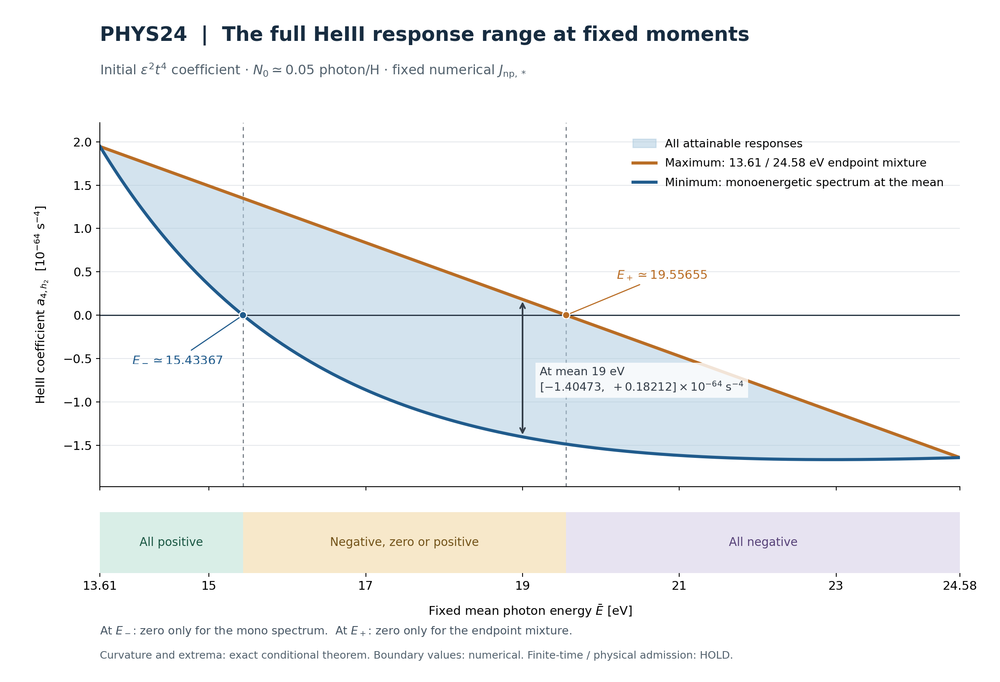

# PHYS24 — 고정 광자 수·평균 에너지 아래 HeIII 초기 응답의 정확한 범위

## 1. 이번 루프의 결론

PHYS23에서 남긴 **FIXED_MOMENT_HEIII_ENVELOPE** 문제를, 실제 초기 기체와 직렬화된 수치 Jacobian을 고정한 조건에서 풀었다. 에너지 지지 구간은 \(I=[a,b]=[13.61,24.58]\) eV이고, 총 광자 수는 \(N_0\simeq0.05\) photon/H, 평균 에너지는 \(m=\bar E\)다.

단색 스펙트럼의 HeIII \(\epsilon^2t^4\) 계수를 \(k(E)\)라고 쓰면, 같은 \(N_0,m\)을 갖는 **모든** 비음수 스펙트럼의 가능한 계수는 정확히

\[
\boxed{\quad
\left[k(m),\ B(m)\right],\qquad
B(m)=\frac{b-m}{b-a}k(a)+\frac{m-a}{b-a}k(b)
\quad}
\tag{1}
\]

이다. 구간의 최솟값은 평균 에너지의 단색 스펙트럼, 최댓값은 13.61/24.58 eV 양 끝점의 두 선 스펙트럼이 달성한다. 내부 평균에서는 두 최적 스펙트럼이 각각 유일하다. 그 사이의 모든 응답도 실제 비음수 스펙트럼으로 달성된다.

핵심 새 증거는 **실제 커널의 구간 전체 엄격한 볼록성**이다. \(g''\)를 양의 인자와 14차 유리계수 다항식의 곱으로 환원했고, Bernstein 계수 15개가 모두 엄밀히 양수임을 정확한 유리수 연산으로 확인했다. 양 끝점의 반대 부호도 같은 방식으로 인증했다. 작은 에너지 격자의 관찰을 연속 최적성 증명으로 사용하지 않았다. [곡률 유도](contributions/curvature/CURVATURE_DERIVATION_KO.md), [정확한 인증 결과](contributions/curvature/CURVATURE_CERTIFICATE.json), [모멘트 정리](contributions/moments/MOMENT_EXTREMIZERS_KO.md)가 직접 근거다.

두 경계는

\[
E_-\simeq15.43367086782694\ {\rm eV},\qquad
E_+\simeq19.55655167718412\ {\rm eV}
\tag{2}
\]

이며, 각각 \(k(E_-)=0\), \(B(E_+)=0\)으로 정의한다.

| 평균 에너지 | 가능한 HeIII 초기 계수의 부호 |
|---|---|
| \(13.61\le m<E_-\) | 모든 허용 스펙트럼에서 양수 |
| \(m=E_-\) | 0 또는 양수; 단색 스펙트럼만 0 |
| \(E_-<m<E_+\) | 음수·0·양수 모두 가능 |
| \(m=E_+\) | 음수 또는 0; 양 끝점 혼합만 0 |
| \(E_+<m\le24.58\) | 모든 허용 스펙트럼에서 음수 |

식 (1)의 최적화 정리는 **고정된 수치 \(J\)를 정확한 상수로 해석한 조건부 수학 명제**다. 식 (2)의 소수값은 수치 평가이며, 원래 Jacobian·단면적·초기 상태의 물리적 불확실성을 둘러싼 자릿수가 아니다. 최종 연구 단계 판정의 권한과 고정 후보 검토 결과는 [독립 판정](independent/DECISION_REVIEW.json), [검토문](independent/DECISION_REVIEW_KO.md)에 둔다. Physical admission은 HOLD다.

그림의 두 곡선 사이가 정확한 가능 구간이다. 곡선을 그린 241점은 표현용 평가이며, 구간 전체의 수학적 근거는 유리수 곡률 인증과 모멘트 정리다. 세 색 구간의 경계에서는 위 표의 등호 조건을 적용한다.

## 2. 질문의 동기와 고정 입력

PHYS23은 동일한 광자 수와 총 에너지를 갖는 두 스펙트럼이 HeIII 초기 계수의 반대 부호를 낼 수 있음을 보였다. 따라서 평균 에너지의 단색 모델만으로 일반 스펙트럼을 대신하면 부호도 틀릴 수 있다. 이번 질문은 이 정보 손실을, 주어진 두 모멘트 아래에서 가능한 **전체 응답 범위**로 정량화하는 것이다. 초기 기체나 생산 광자 source를 바꾸는 문제로 전환하지 않았다. [PHYS23 보고서](inputs/inherited/PHYS23_REPORT_KO.md) §§8–9와 [이번 루프의 원래 handoff](inputs/inherited/PHYS24_INTAKE_HANDOFF_KO.md)를 닫힌 입력으로 소비했다.

| 입력 identity | 고정값 |
|---|---|
| 저장소 | cosmosapjw-quantum/rei_bianchi |
| 연구 branch | forward/rust-reion-kernels-20260922 |
| 실제 PHYS24 input commit | 6104a9655439b15143933a97b9926e61dfb62b53 |
| Input root tree | 4677621ec12994af5f637f582888713e23845361 |
| Scientific Rust src tree | cb69b4736dd046e4675557577eb8e0ead037d1f3 |
| PHYS24 계약 SHA256 | fd60772fa082a651034b21b965133e57cc0c3e37bb14cdab531a5ca3965266e2 |
| PHYS22 수치 계수/J 입력 SHA256 | 6c7a4f239ef48c2a7c60592fc048600317f1233f3028434ebd1b3c7e55682a79 |

현재 PR head와 immutable commit/tree를 읽고, 필요한 source 7개의 로컬 바이트·크기·Git blob identity가 그 tree와 일치함을 확인했다. 기존 연구 전체를 재실행한 것이 아니다. [SOURCE_MANIFEST.json](SOURCE_MANIFEST.json), [원격 입력 확인](evidence/REMOTE_INPUT_IDENTITY.json), [로컬 입력 비교](evidence/LOCAL_INPUT_IDENTITY.json)에 각각의 범위를 기록했다. 위 input commit과 이후 PHYS24 publication commit은 구별한다.

기체의 고정 초기 상태는

\[
H_*=10^{-14}\ {\rm s}^{-1},\quad n_{H,*}=10^{-4}\ {\rm cm}^{-3},\quad
f_{\rm He}=0.083,
\]
\[
(x_*,h_{1,*},h_{2,*},T_*)=(0.9,0.3,0.6,50000\ {\rm K}).
\tag{3}
\]

Source binary64 literal을 정확한 실수로 해석한다. \(N_0=\operatorname{f64}(0.05)\), \(\varsigma=[\operatorname{f64}(1.01\times10^{-14})-\operatorname{f64}(0.99\times10^{-14})]/2\), \(q=2\varsigma^2\simeq1.9999999999999703\times10^{-32}\ {\rm s}^{-2}\)다. 이는 매 연산마다 native f64로 반올림하는 계산과의 등가성을 주장하지 않는다. 광자 생성률 \(S=5\times10^{-15}\) photon H\(^{-1}\) s\(^{-1}\)와 production birth energy 13.7 eV는 기존값이다.

이번 \(a,b\)는 exact decimal 진단 에너지이며 두 opacity cutoff 사이에 엄격히 들어 있다. HI opacity cutoff는 \(\operatorname{f64}(13.60)\) eV, HeI cutoff는 \(\operatorname{f64}(24.59)\) eV다. 열 전달 에너지 \(\chi=\operatorname{f64}(13.598434599702)\) eV를 opacity cutoff와 바꾸어 쓰지 않았다. 실제 식·상수의 직접 출처는 [atomic_provider.rs](inputs/pinned_source/rust/rei_microphysics/src/atomic_provider.rs)의 cross_section 및 [hhe_events.rs](inputs/pinned_source/rust/rei_microphysics/src/hhe_events.rs)다.

## 3. 관측량·정규화·단위

Metric은 \((-+++)\), 시간은 기체와 함께 움직이는 proper seconds, 에너지는 eV, 열 상태 \(w\)는 eV/H다. 초기 전단은 \(B=t\Sigma\), \(\Sigma=\varsigma\operatorname{diag}(1,-1,0)\)로 고정한다.

\[
F_2=[\epsilon^2]F=\frac12\left.\partial_\epsilon^2F\right|_0,
\qquad
h_{2,2}(t)=a_{4,h_2}t^4+O(t^5).
\tag{4}
\]

\(h_2\)는 헬륨 중 HeIII 분율이다. \(a_{4,h_2}\)는 전단에 대한 \(\epsilon^2\) 계수의 초기 \(t^4\) 항이며 추가 factorial을 붙이지 않는다. 음의 \(a_4\)는 HeIII 분율 자체가 음수라는 뜻이 아니다. 유한 시간 또는 유한 \(\epsilon\)에서 전체 해의 차이를 결정하려면 별도의 나머지 경계가 필요하다.

초기 등방적 photon-number measure를 \(\nu_0\)라 하자. \(\nu_0\)는 \(\epsilon\)에 독립적인 유한 비음수 Borel measure이며 델타 선도 허용한다.

\[
\int_I d\nu_0=N_0,\qquad \int_I E\,d\nu_0=N_0m,
\qquad dP=d\nu_0/N_0.
\tag{5}
\]

따라서 \(P\)는 평균 \(m\)의 확률측도다. PHYS22에서 닫힌 초기 계수식을 사용하면

\[
D=E\partial_E,\quad\mathscr C=D(D+3),\quad
\lambda(E)=\kappa\sigma(E),\quad\kappa=c\,n_{H,*}(1-x_*)>0,
\]
\[
a_{3,x}=\frac q{45}\int\mathscr C\lambda\,d\nu_0,\qquad
a_{3,w}=\frac q{45}\int\mathscr C[\lambda(E)(E-\chi)]\,d\nu_0,
\]
\[
a_{4,h_2}=\frac14\left(J_{h_2,x}a_{3,x}+J_{h_2,w}a_{3,w}\right).
\tag{6}
\]

미분은 고정 초기 기체에서 kernel에 작용한다. 스펙트럼을 미분하거나 threshold를 가로지르는 적분 by parts를 수행하지 않는다. 이 식의 국소 시간 유도와 기존 H/thermal 부호 suite는 이번에 다시 실행하지 않았다.

이로부터

\[
g(E)=\frac14\left[J_{h_2,x}\mathscr C\lambda(E)
+J_{h_2,w}\mathscr C[\lambda(E)(E-\chi)]\right],
\qquad k(E)=\frac{qN_0}{45}g(E),
\]
\[
\boxed{a_{4,h_2}(P)=\int_I k(E)\,dP(E).}
\tag{7}
\]

\(\lambda\)는 s\(^{-1}\), \(D\)는 무차원이며, \(g\)는 s\(^{-2}\), \(k\)와 \(a_4\)는 s\(^{-4}\)다. \(J_{h_2,w}\)에는 \(w\)의 eV/H 정규화가 들어 있다. 기존 helper의 HeIII_t4_s-4는 이미 \(k\)여서 \(qN_0/45\)를 다시 곱하지 않는다.

광자 수 가중치와 에너지 분율은 다르다. 이 문제의 \(P\)는 photon-number probability이며, energy-fraction probability를 직접 같은 가중치로 대입하면 다른 최적화 문제를 푼다. \(N_0,q\)의 양의 배율은 응답의 전체 크기를 바꾸지만 이 고정 \(g\)의 부호 경계는 바꾸지 않는다. \(N_0=0\) 또는 \(q=0\)인 퇴화 경우의 계수는 0이며 이번 고정 비영 계약의 분류와 구별한다.

## 4. 일반적인 두 모멘트 문제의 구조

연속함수 \(g\)에 대해

\[
\mathcal P_m=\{P\ge0:\int dP=1,\ \int E\,dP=m\}
\]

를 생각하자. 그래프 \(\Gamma=\{(E,g(E)):E\in I\}\)의 평면 볼록껍질 \(C\)를 취하면

\[
\left(m,\int g\,dP\right)\in C.
\tag{8}
\]

유한 볼록결합에서 그래프 점이 네 개 이상이면 \((1,E_i,g(E_i))\in\mathbb R^3\)의 선형 종속성을 이용해 질량·평균·응답을 보존하면서 한 가중치를 0으로 만들 수 있다. 반복하면 세 점 이하로 줄어든다. 따라서 \(C\)는 compact한 매개변수 집합의 연속상이며 닫혀 있다. 일반 측도의 적분도 균등연속성을 통한 유한합의 극한으로 \(C\)에 속하고, 반대로 \(C\)의 점은 유한 선 스펙트럼으로 구현된다.

평균을 고정하는 것은 \(C\)를 수직선 \(E=m\)으로 자르는 일이다. 그 절편은 비어 있지 않은 compact한 볼록집합이므로 하나의 닫힌 구간 \([L_g(m),U_g(m)]\)이다. 하단점이 비공선 세 점의 양의 볼록결합이면 삼각형 내부에 있어 같은 평균의 더 낮은 점도 가능하므로 모순이다. 상단도 같다. 그러므로 각 극값을 달성하는 **두 점 이하 스펙트럼이 존재**한다.

두 점 \(u\le m\le v\)를 사용한 경우 가중치는

\[
P_{u,v;m}=\frac{v-m}{v-u}\delta_u+\frac{m-u}{v-u}\delta_v.
\tag{9}
\]

하단의 최적 측도들을 섞으면 \(L_g\)의 볼록성이 따르고, 단색 \(\delta_m\)로 \(L_g\le g\)다. 어떤 볼록함수 \(h\le g\)도 식 (9)의 최적 측도에 볼록성 부등식을 적용하면 \(h\le L_g\)다. 따라서 \(L_g\)는 lower convex envelope다. 상단은 부호를 뒤집은 논법으로 upper concave envelope다. [모멘트 기여문](contributions/moments/MOMENT_EXTREMIZERS_KO.md) §2가 compactness·달성·등호 조건을 모두 적었다.

이 일반 정리의 극점 구조는 Pinelis의 모멘트 집합 연구에서 Polish/Borel 공간의 두 제약 \(f=(1,E)\)에 대한 결과와 부합한다. 이번 증명은 위의 평면 특수화로 직접 닫는다. 원문의 역할은 일반 구조의 근거 확인이며, 실제 HeIII 곡률이나 부호 수치의 출처가 아니다. [Pinelis, arXiv:1204.0249v1, Corollary 11](https://arxiv.org/pdf/1204.0249).

## 5. 실제 HeIII 커널의 엄격한 볼록성

원래 HI 식의 매끄러운 branch를

\[
\sigma(E)=\sigma_0c_{\rm area}(X-1)^2X^{p/2-11/2}(1+z)^{-p},
\quad X=E/E_0=y_a z^2,
\quad z=\sqrt{E/(E_0y_a)}
\tag{10}
\]

로 쓴다. \(E_0=\operatorname{f64}(0.4298)\) eV, \(y_a=\operatorname{f64}(32.88)\), \(p=\operatorname{f64}(2.963)\), \(\sigma_0=\operatorname{f64}(5.475\times10^4)\), \(c_{\rm area}=\operatorname{f64}(10^{-18})\ {\rm cm}^2\)다.

\[
\alpha=D\log\sigma=-\frac72+\frac2{X-1}+\frac p{2(1+z)},
\quad\beta=D\alpha,\quad A=\alpha^2+3\alpha+\beta,
\]
\[
H_c=(E-c)A+E(2\alpha+4).
\tag{11}
\]

수치 입력은

\[
J_x=J_{h_2,x}\simeq-6.013268338110974\times10^{-17}\ {\rm s}^{-1},
\quad
J_w=J_{h_2,w}\simeq2.527594769616328\times10^{-18}
\ (\mathrm{eV/H})^{-1}{\rm s}^{-1}.
\]

\(\eta=\chi-J_x/J_w\simeq37.38891086747711\) eV를 두면

\[
g=\frac{\kappa\sigma J_w}{4}H_\eta.
\tag{12}
\]

\(\eta\)는 대수적 이동 상수이며 새로운 물리 threshold가 아니다. 이 표현에서 \(\kappa,\sigma,J_w\)는 양수다.

\(G=(y_a z^2-1)(1+z)\)를 두고 \(\alpha=N/(2G)\), \(H_\eta=P_\eta/(4G^2)\)로 정리한다. 여기서 \(N\)은 photon number와 다른 다항식 표기이며 \(P_\eta\)는 8차다. \(D=(z/2)\partial_z\), \(E^2g''=D(D-1)g\)를 사용하면

\[
\boxed{g''(E)=\frac{\kappa\sigma(E)J_w}{64E^2G(z)^4}R(z)}
\tag{13}
\]

이고 \(R\)은 14차 유리계수 다항식이다. 모든 정의와 두 가지 독립적인 다항식 전개는 [곡률 기여문](contributions/curvature/CURVATURE_DERIVATION_KO.md) §2와 [실행 코드](contributions/curvature/exact_curvature_certificate.py)에 있다. 이는 기여자 내부의 대수적 교차 확인이며 별도 사람의 검토와는 구별한다.

정확한 유리수 산술로

\[
z(I)\subset[49/50,33/25],\qquad G>0
\]

를 확인했다. \(t=(z-49/50)/(33/25-49/50)\)에 대한 전개

\[
R(z(t))=\sum_{j=0}^{14}b_j\binom{14}{j}t^j(1-t)^{14-j}
\tag{14}
\]

의 모든 \(b_j\)가 양수다. Bernstein 기저의 각 항은 비음수이고 합은 1이므로 \(R\ge\min_jb_j>0\)다. 최소 계수의 표시값은 약 \(8.7323060\times10^{10}\)이지만, 실제 판단은 JSON에 보존한 정확한 분자·분모로 했다. 원 단항식 기저로의 역변환도 일치했다. 사전 절차의 이진 구간 분할은 사용할 필요가 없었다.

양 끝 에너지에 해당하는 \(z\)는 정수 제곱근을 이용한 폭 \(10^{-18}\)의 유리수 구간으로 둘러쌌다. 그 구간에서 8차 \(P_\eta\)의 Bernstein 계수가 낮은 끝점은 9/9 양수, 높은 끝점은 9/9 음수였다. 따라서

\[
g''>0\quad\hbox{on }I,\qquad g(a)>0>g(b)
\tag{15}
\]

가 연속구간의 조건부 정확한 명제다. 보조 \(z\) 구간에서 HI 적합식을 대수적으로 연장한 것은 다항식 인증용이다. 물리 결론은 threshold와 분리된 원래 \(I\)에만 적용한다. 또한 이 인증은 명시적 exact-arithmetic 프로그램이지 증명 보조기의 신뢰 커널에서 형식 검증한 결과는 아니다.

## 6. 극값과 달성 스펙트럼

\(g''>0\)와 양의 정규화 때문에 \(k\)도 엄격히 볼록하다. Jensen 부등식으로

\[
\int k(E)\,dP(E)\ge k\left(\int E\,dP\right)=k(m).
\tag{16}
\]

내부 평균에서 등호는 \(P=\delta_m\)일 때만 가능하다. 상단은 각 \(E\)에서 \(k(E)\le B(E)\)이고 \(B\)가 아핀함수라는 사실로

\[
\int k\,dP\le\int B\,dP=B(m).
\tag{17}
\]

내부에서는 \(k(E)<B(E)\)이므로 상단을 달성하려면 끝점 외의 질량이 없어야 한다. 따라서

\[
P_{\min}=\delta_m,
\qquad
P_{\max}=\frac{b-m}{b-a}\delta_a+\frac{m-a}{b-a}\delta_b
\tag{18}
\]

가 각각 유일한 최적 측도다. 실제 photon-number measure는 \(N_0P\)다. \(m=a\) 또는 \(m=b\)이면 허용 측도 자체가 해당 끝점의 단색뿐이며 두 경계가 합쳐진다.

구간 사이가 비어 있지 않다는 점도 구성적으로 보일 수 있다.

\[
P_\theta=(1-\theta)\delta_m+\theta P_{\max},\qquad0\le\theta\le1
\]
\[
a_4(P_\theta)=(1-\theta)k(m)+\theta B(m).
\tag{19}
\]

이 구성은 같은 질량·평균을 유지하면서 전체 구간을 훑는다. 세 개 이하의 선이 충분하다는 명시적 구성이며, 세 선이 필요하다는 최소성 주장은 아니다.

실제로 내부 평균에서 왼쪽 끝점 \(a\)를 고정한

\[
P_v=\frac{v-m}{v-a}\delta_a+\frac{m-a}{v-a}\delta_v,
\qquad m\le v\le b
\]
\[
a_4(P_v)=k(a)+(m-a)\frac{k(v)-k(a)}{v-a}
\tag{20}
\]

도 \(k(m)\)에서 \(B(m)\)까지 연속·엄격히 증가한다. 고정점에서의 할선 기울기가 엄격히 증가하기 때문이다. 따라서 **모든 중간 응답도 두 선 이하로 달성**할 수 있다. 식 (20)의 특정 경로 위 \(v\)의 유일성과 모든 가능한 스펙트럼 표현의 유일성은 서로 다르다. [모멘트 기여문](contributions/moments/MOMENT_EXTREMIZERS_KO.md) §3.1.

## 7. 두 평균 에너지 경계와 등호 사례

식 (15)의 끝점 부호로 \(k\)의 내부 영점이 존재한다. 두 영점 \(u<v<b\)가 있다면 볼록함수의 할선 기울기 순서가

\[
0=\frac{k(v)-k(u)}{v-u}\le\frac{k(b)-k(v)}{b-v}<0
\]

를 강제하므로 모순이다. 따라서 \(E_-\)는 유일하다. 이번에는 이 존재·유일성을 새 곡률/끝점 인증으로도 닫았고, **위치**는 PHYS23의 닫힌 수치 bracket을 소비했다. 새 반복 근 찾기는 수행하지 않고, 새 Taylor 경로로 그 두 끝의 부호만 한 번 확인했다.

상단 \(B\)는 엄격히 감소하는 직선이며

\[
E_+=a+(b-a)\frac{k(a)}{k(a)-k(b)}.
\tag{21}
\]

엄격한 chord gap으로 \(B(E_-)>k(E_-)=0\)이므로

\[
a<E_-<E_+<b.
\tag{22}
\]

고정 입력의 Decimal160 평가에서

\[
k(a)=+1.9458853834603740725\times10^{-64}\ {\rm s}^{-4},
\]
\[
k(b)=-1.6438190058014869789\times10^{-64}\ {\rm s}^{-4},
\]
\[
E_+=19.55655167718411626044\ldots\ {\rm eV}.
\tag{23}
\]

새 수치 bracket은

\[
[19.55655167718411626044,\ 19.55655167718411626045]\ {\rm eV}
\tag{24}
\]

이고 폭은 \(10^{-20}\) eV다. 양끝 chord 값은 각각 \(+5.36793\times10^{-86}\), \(-2.73550\times10^{-85}\ {\rm s}^{-4}\)다. PHYS23에서 받은 \(E_-\) bracket 폭은 약 \(6.77626\times10^{-21}\) eV다. 두 bracket 모두 수치 연산 결과이며 rigorous interval root enclosure나 입력 오차 경계로 주장하지 않는다. 수학적 경계는 식 (2)의 영점 정의이고, 반올림한 15.43367 또는 19.55655를 정확한 경계로 사용하는 것이 아니다. [수치 결과](contributions/numerics/MOMENT_ENVELOPE.json)의 mono_zero_inherited와 endpoint_chord_zero.

\(m=E_-\)에서는 \(P=\delta_{E_-}\)만 0이고 다른 허용 스펙트럼은 양수다. \(m=E_+\)에서는

\[
P_{\max}\simeq0.4579260093724598\,\delta_{13.61}
+0.5420739906275402\,\delta_{24.58}
\tag{25}
\]

만 0이고 나머지는 음수다. 식 (25)의 실제 가중치는 식 (18)에 정확한 \(E_+\)를 넣은 것으로 정의하며 소수는 표시값이다.

혼합 부호 구간에서는

\[
\theta_0=\frac{-k(m)}{B(m)-k(m)}\in(0,1)
\tag{26}
\]

를 식 (19)에 넣어 항상 0 응답을 만들 수 있다. \(\theta<\theta_0\)는 음수, \(\theta>\theta_0\)는 양수다. 영 응답은 이 \(t^4\) 항의 소멸만 뜻하며 다음 시간차수의 부호는 미해결이다.

## 8. 수치 범위와 PHYS23 반례의 위치

아래 표는 모든 항이 **\(10^{-64}\ {\rm s}^{-4}\) 단위**다. 끝값의 정의는 정확한 식 (1)이며 수치는 표시용 반올림이다.

| 평균 \(m\) [eV] | 최솟값: 단색 | 최댓값: 끝점 혼합 | 부호 정보 |
|---:|---:|---:|---|
| 13.61 | +1.945885 | +1.945885 | 단일 허용 측도, 양수 |
| 14 | +1.407224 | +1.818266 | 양수 강제 |
| 16 | −0.373790 | +1.163808 | 양·음 모두 가능 |
| 17.01327843 | −0.867572 | +0.832233 | PHYS23 반례의 평균 |
| 18 | −1.189877 | +0.509349 | 양·음 모두 가능 |
| 19 | −1.404734 | +0.182120 | 양·음 모두 가능 |
| \(E_+\simeq19.55655168\) | −1.488168 | 0 | 비양수, 끝점 혼합만 0 |
| 20 | −1.539989 | −0.145109 | 음수 강제 |
| 22 | −1.657231 | −0.799568 | 음수 강제 |
| 24.58 | −1.643819 | −1.643819 | 단일 허용 측도, 음수 |

평균 19 eV에서 단색 모델은 \(-1.404734127194\times10^{-64}\ {\rm s}^{-4}\)를 주지만, 같은 \(N,U\)의 끝점 혼합은 \(+1.821199633946\times10^{-65}\ {\rm s}^{-4}\)를 준다. 이 평균이 mono 영점보다 높다고 일반 스펙트럼까지 음수인 것은 아니다. 음수가 모든 스펙트럼에 강제되는 경계는 \(E_+\)다.

PHYS23의 기존 14/24 eV 혼합 반례는 한 번만 좁게 확인했다. 그 평균 \(m\simeq17.01327843259209\) eV에서

\[
\underbrace{-8.675716405321\times10^{-65}}_{k(m)}
<0<
\underbrace{+4.839791931529\times10^{-65}}_{\text{기존 14/24 혼합}}
<
\underbrace{+8.322332843395\times10^{-65}}_{B(m)}
\tag{27}
\]

가 성립한다. 같은 총 광자 수와 총 에너지에서의 반례가 이번 정확한 범위 내부에 놓인다. 기존 반례 자체가 최대 응답 스펙트럼인 것은 아니다. 새 Taylor 경로와 기존 혼합·단색 계수의 최대 상대차는 약 \(4.007\times10^{-109}\), 사전 허용오차는 \(10^{-95}\)였다.

별도 내부 지지 분포도 확인했다. 평균 18 eV에서

\[
0.6\delta_{14}+0.4\delta_{24}
\quad\Rightarrow\quad a_4=+1.816555535902\times10^{-65}\ {\rm s}^{-4},
\]
\[
0.3\delta_{14}+0.5\delta_{18}+0.2\delta_{24}
\quad\Rightarrow\quad a_4=-5.041109146691\times10^{-65}\ {\rm s}^{-4}.
\tag{28}
\]

둘 다 확률 가중치 합은 1, 평균은 18 eV이며 실제 광자 measure에는 같은 \(N_0\)를 곱한다. 양·음 모두 가능한 성질은 cutoff에 아주 가까운 끝점 두 선만으로 만든 예시에 국한되지 않는다. 식 (19)의 평균 18 eV 구성에서는 \(\theta_0\simeq0.7002464629200613\)이 0 응답을 준다. [수치 기여문](contributions/numerics/MOMENT_NUMERICS_KO.md), [원 결과](contributions/numerics/MOMENT_ENVELOPE.json).

## 9. 물리적으로 해석할 수 있는 내용

HeIII의 이 차수 응답은 HI-only 광자가 만드는 수소 이온화·열 변화가 비광이온화 Jacobian의 두 항을 통해 전달되는 구조다. 고정한 \(J_x<0<J_w\)에서 두 경로의 결합이 에너지 의존적인 양·음 전환을 만든다. 새로운 direct HeI/HeII 광이온화 채널을 켠 결과가 아니다.

엄격한 볼록성이 뜻하는 것은 **동일 평균의 어떤 비단색 스펙트럼도 단색보다 큰 \(a_4\)**를 준다는 것이다. 두 임의 스펙트럼 사이에서 분산이 더 큰 쪽의 응답이 반드시 더 크다고 증명한 것은 아니다. 분산 하나로 임의의 스펙트럼 순서를 정하는 명제는 이번 모멘트 정리에서 나오지 않는다.

기존 HII·heat·50000 K 온도의 음의 초기 부호와 HeIII의 혼합 가능한 부호는 양립한다. PHYS23의 H/thermal 전체 구간 정리를 닫힌 입력으로 유지했으며 이번에 그 suite를 다시 실행하거나 다른 초기 온도의 물리 정확도를 새로 주장하지 않았다.

스펙트럼을 반드시 연속 밀도로 제한하거나 최소 선폭·정규성을 추가하면 델타 극값의 실제 달성 여부가 달라진다. 이번 정확한 극값은 델타 선을 포함한 비음수 측도라는 계약에 관한 것이다. 그런 추가 모델 제약은 자동으로 부여하지 않았다.

## 10. 실제 검증과 독립성

| 근거 | 최초 실제 결과 | 담당 역할과 의미 |
|---|---|---|
| Exact rational 곡률/끝점 인증 | 20/20 PASS, exit 0 | 곡률 기여자; 연속구간의 부호·정의역·항등식 |
| Decimal160 원식 Taylor jet / direct FD / 모멘트 검산 | 156/156 PASS, exit 0 | 수치 기여자; 별도 미분 경로와 정규화·구성 확인 |
| 새로운 \(k''\) 비교 | 7개 에너지, 최대 상대차 \(2.154\times10^{-61}\) | 사전 허용오차 \(10^{-42}\); 전체 구간 증명과 구별 |
| PHYS23 기존 반례 anchor | 혼합·단색 두 계수와 모멘트 일치 | 반례 하나의 좁은 연결; H/T suite 재생 없음 |
| 그림 | 241점 표시, render exit 0, 시각 점검 | 표시용이며 독립 검산 수에 합산하지 않음 |
| 별도 최종 decision | [독립 판정 파일](independent/DECISION_REVIEW.json) | 후보 생성·검증 설계와 분리된 검토자 |

20과 156은 실행된 assertion 수이며 서로 다른 물리 법칙의 개수나 독립 연구 횟수가 아니다. 프로그램 최초 실행은 각각 한 번이다. 두 프로그램의 source·protocol은 실행 전에 해시로 고정했고 최초 과학 assertion 실패, 과학 수정, 허용오차 변경은 없었다. [곡률 EXECUTION](contributions/curvature/EXECUTION.json), [수치 EXECUTION](contributions/numerics/EXECUTION.json), 두 폴더의 pre-execution freeze와 원 로그가 근거다.

수치 경로는 원래 단면적을 사용한

\[
f(E)=\sigma(E)[J_x+J_w(E-\chi)],\qquad
k(E)=\frac{qN_0\kappa}{180}(D^2+3D)f(E)
\]
\[
k''(E)=\frac{qN_0\kappa}{180E^2}
(D^4+2D^3-3D^2)f(E)
\tag{29}
\]

를 평가했다. 첫 경로는 \(E e^s\)에 대한 4차 Taylor jet, 두 번째는 13점 중심 로그 에너지 차분이다. 차분 가중치는 유리수 모멘트 방정식에서 별도로 구했고, \(h=10^{-5}\), \(h/2\), Richardson factor 1024를 사용했다. 모든 stencil이 두 cutoff 사이에 있음을 확인했다. 유한차분 오차의 rigorous remainder enclosure는 제공하지 않는다.

수치 **방법과 검증 설계**는 다른 기여자의 성공 요약을 받기 전에 고정했다. 다만 첫 실행 전 root로부터 곡률 성공·끝점 부호 요약을 받았으므로, 실행 시점의 눈가림 검증은 아니다. 다른 기여자의 코드·상세 전개·원 결과 파일은 그 전에 읽지 않았다. 고정 protocol의 더 넓은 execution-before 독립성 문구는 원본을 바꾸지 않고 [INDEPENDENCE_ACTUAL.json](contributions/numerics/INDEPENDENCE_ACTUAL.json)에서 실제 순서로 제한했다.

최종 판정자는 후보 생성과 검증 설계에 참여하지 않은 별도 agent다. Full-history를 상속한 비맹검 검토이며, owner의 수식/파일 확인은 OWNER_SELF_REVIEW다. 독립 검토 중 수치 노트의 수식 구분자·제어문자 문제를 발견하여 문서 형식만 바로잡았다. 원 노트와 [포맷 정정 기록](contributions/numerics/FORMAT_CORRECTION.json)을 보존했고 과학 코드·절차·결과·실행 기록은 바꾸지 않았다.

## 11. Claim과 증거 상태

| Claim | 근거 상태 | 직접 근거와 제한 |
|---|---|---|
| 선형 스칼라 응답과 고정 모멘트 정규화 | inherited established within scope + derived | PHYS22 함수식, PHYS24 식 (5)–(7); 새 IVP 아님 |
| 실제 \(g''>0\), 끝점 부호·유일 영점 존재 | derived + implementation-verified | Exact rational 14차/8차 인증; 고정 수치 \(J\) 조건부 |
| 정확한 상·하한과 최적 측도의 유일성 | derived | 연속구간 곡률 + compact 모멘트 정리 + Jensen/chord |
| 모든 중간값의 두 선 이하 달성 | derived | 식 (20)의 연속·엄격 단조 경로 |
| 평균 에너지의 다섯 부호 구간 | derived | 정확한 \(E_-,E_+\) 정의 및 envelope |
| \(E_-,E_+\) 소수값·표·반례 연결 | numerically checked + implementation-verified | Decimal160 결과; 물리 입력 오차 미포함 |
| 유한 시간·유한 전단 부호 및 물리 admission | unresolved / HOLD | 이 루프의 범위 밖 |

[RESULTS_SUMMARY.json](RESULTS_SUMMARY.json)과 [CLAIM_DAG.json](CLAIM_DAG.json)이 claim에서 직접 코드·결과·입력으로 이어지는 경로를 기록한다. 해시·commit은 바이트 identity의 근거이며 스스로 물리 정확성이나 실행의 독립성을 보증하지 않는다.

문헌은 Pinelis 논문의 초록·서지와 모멘트 극점 관련 해당 정리/가정을 제한적으로 읽었다. Owner는 Polish/Borel 부분과 Corollaries 10–11을 직접 확인했고, 이론 기여자의 더 넓은 제한 열람 범위는 [EVIDENCE_SCOPE.json](contributions/moments/EVIDENCE_SCOPE.json)에 있다. 2016년 저널 판본 전체나 후속 인용문헌 원문을 읽었다고 주장하지 않는다. [문헌 범위 기록](evidence/LITERATURE_SCOPE.json). 전 지구적 신규성은 주장하지 않는다.

## 12. 재현·보호 조건·종료

이번 루프에서 native run 0, gas IVP 0, PHYS19–23의 닫힌 과학 main/suite replay 0, 대규모 campaign 0이다. Production source/default/runtime 변경은 없다. Physical HOLD, 기존 [160,161] FAIL, tick160, auxiliary escape FAIL, HH/RCT/CR OFF, precision atomic PARKED를 유지한다.

완성 묶음의 [재현 안내](README_REPRODUCE_KO.md)는 파일 무결성만 확인하는 모드와 **새 PHYS24 프로그램 두 개만** 재생하는 모드를 구별한다. 새 portability 실행이 있으면 추가 독립 물리 검산으로 합산하지 않는다. 실제 실행·비교는 portability receipt, 최종 archive 복구와 동일 branch nonforce additive docs 게시의 ACK/tree/blob 확인은 묶음에 수반되는 detached PHYS24_PUBLICATION_RECEIPT.json을 따른다. 이 과학 보고서에 미래 게시 커밋을 미리 넣지 않는다.

따라서 이 루프의 종료 근거는 고정된 질문의 정확한 가능 구간, 부호 분할, 실제 판별 검산, 별도 최종 판정이다. 같은 실패의 재시도나 닫힌 기존 suite를 반복할 미해결 과학적 이유는 없다.

## 13. 다음 단일 질문

다음은 **PHYS25_HEIII_SIGN_REVERSAL_VARIANCE_COST**다.

> 같은 기체·\(N_0\)·지지 구간을 유지하고 평균을 18 eV로 고정할 때, HeIII 초기 계수를 비음수로 만들기 위해 필요한 광자 에너지 분산의 최솟값은 얼마인가?

PHYS24는 평균만으로 부호를 고정할 수 없는 구간과 정확한 응답 범위를 얻었다. 후속 질문은 그중 대표 평균 하나에서 부호를 바꾸는 데 필요한 최소 스펙트럼 폭을 정량화한다. 식 (20)이 영 응답을 주는 두 선의 존재를 보장하더라도, 그 분포가 **분산까지 최소**라는 결론은 아직 나오지 않는다. 그것을 실제 최적성 증거로 판별해야 한다.

분산을 추가로 고정한 전체 이차원 phase diagram, 다른 초기 기체, 새로운 gas history로 자동 확장하지 않는다. [PHYS25 handoff](PHYS25_NEXT_HANDOFF_KO.md)에 목적함수·고정 입력·최소 완료 기준과 증명되지 않은 부분을 남겼다. PHYS25는 이번에 실행하지 않았다.
