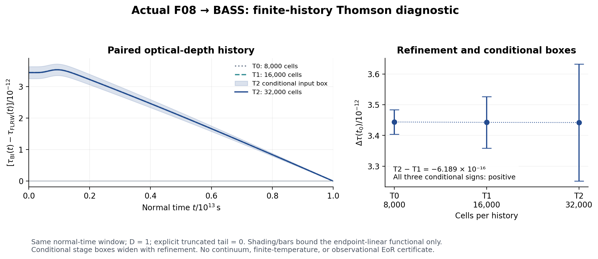

# REI–REC–BASS SYNC03 연구 결과 · 2026-10-07

실제 F08 이력의 BASS 수신을 완료하고, 네 스레드를 동기화한 다음 조건부 광학깊이 오차를 전파하는 두 번째 연구 루프를 실행했다. 기존 solver/원자 owner 작업은 수정하지 않았다. 첫 S0 paired plot은 10월 5일 이미 완료된 결과이며, 이번에는 그 실제 이력에서 새로운 BASS 관측량 진단 그림을 얻었다.

## 1. 새 실행과 판정

| 연구 루프 | 실제 실행 | 결과와 적용 범위 |
|---|---|---|
| Loop 1 이론→코딩 | F08 T0/T1/T2 × FLRW/BI, 112,000 cells. 기존 BASS frame/visibility/clock 모듈을 그대로 별도 컴파일. Decimal70 784,054 checks. | PASS. 최대 τ 절대차 1.148×10⁻¹⁹. 독립 reviewer가 T2 두 이력 전체를 exact rational 적분으로 별도 검증. Full BASS build/production routing은 범위 밖. |
| 중간 동기화 | `state/FOUR_THREAD_SYNC.json`과 `SYNC_GATE_LOOP1.json` 생성 후 Loop2 실행. | 최신 source pin·적용 domain·owner 예약 작업·미제공 tail 고정. |
| Loop 2 이론→코딩 | 공급된 조건부 endpoint ne boxes를 Decimal90 방향 반올림으로 전파. 세 해상도의 paired observable 및 201개 공통 시각 그림. | 초기 시각에서 전체 유한 구간을 적분한 Δτ의 조건부 부호 양수. 연속 시간해/physical EoR 부호 인증은 아님. |

세부 결과는 `loop1/RETURN.json`, `loop2/TRANSFER_RESULT.json`, `loop2/ERROR_LEDGER.json`, `review/`에 있다. 수치가 통과한 것과 reviewer의 한정된 admission을 구별한다.

## 2. 핵심 수치

정상 관측자, D=1, normal time 0–10¹³ s, proper ne, 명시적인 truncated tail=0. q=c σT ne. Endpoint 선형 보간과 같은 셀 적분을 갖는 평균 rate를 실제 BASS에 전달했다. 표의 τ는 전체 우주의 reionization optical depth가 아니다.

| 해상도 | 셀/이력 | Δτ = BI−FLRW | 조건부 하한 | 조건부 상한 |
|---|---:|---:|---:|---:|
| T0 | 8,000 | 3.444081352e-12 | 3.404450000e-12 | 3.483712704e-12 |
| T1 | 16,000 | 3.442845412e-12 | 3.358647781e-12 | 3.527043043e-12 |
| T2 | 32,000 | 3.442226494e-12 | 3.251123679e-12 | 3.633329308e-12 |

T2 FLRW τ≈1.85561102041427×10⁻⁵, BI τ≈1.85561136463692×10⁻⁵. 상대 차이는 1.8550×10⁻⁷. T2−T1 contrast 변화는 −6.1892×10⁻¹⁶, T2 signal의 0.01798%. 차이 비율 1.99693은 경험적 refinement diagnostic이고 연속 오차 상한이 아니다.

T2 조건부 box 반폭 1.91103e-13는 T2−T1 변화의 약 308.8배다. 더 촘촘한 실행에서 누적 source box가 오히려 넓어졌다. 따라서 새 T3 재실행을 기본 다음 작업으로 삼지 않고, 무엇을 인증할지에 따라 conditional enclosure와 시간/모델 오차를 나누어 해소한다.



그림의 shading/error bar는 통계적 신뢰구간이 아니다. 조건부 endpoint 함수의 enclosure다. 관측자 이후 tail은 공급되지 않았고, tail=0.1은 API control만 수행했다. 같은 tail은 Δτ를 바꾸지 않지만 서로 다른 미지 tail은 차이의 부호를 바꿀 수 있다. 이 그림으로 방향별 sky signal, Q_V, 실제 EoR history를 주장하지 않는다.

## 3. 네 스레드의 수정된 상태

| 스레드 | 수신한 최신 완료 범위 | 현재 owner 작업과 남은 blocker |
|---|---|---|
| REI | F08 완료; 새 SPEC→native cohort 비교; IGM의 선택된 짧은 구간 수송/midpoint 검증. 이번 실제 BASS 수신 추가. | FT_SPEC_BRIDGE02와 IGM 경계/long-history solver 작업은 기존 owner. Long-history·연속 오차·물리 source gate는 별도. |
| HE | HE-FAST-REJOIN01 point 완료. 게시 전 추가 수신: RCT02 native RHS 기준 이력 23 ODE solve 완료(기준해 scope). | 실제 receiver RCT03 native 연결은 미수행·owner 예약. 새 기준 이력 T≈1939.62–2005.46K. 기존 hot FT03/S0와 구분. |
| CR | F04E 완료. 게시 직전 CR-F0-R2 source-fed BE 단계의 실제 fixed-box 3profiles/56macro/168BE solves 및 독립 C9root 비교 수신. | 현재 source-tree 로컬 import/단계 검증 완료. 실제 cosmological driver 및 원격 REI 채택은 미완료. Global history counter/production ACK는 null. |
| HH | 연구 lane ACTIVE. ON05B matched histories와 TH05 FT03 짧은 구간 결과. | ON06 일관된 point/thermal/event/interval/root/checkpoint pilot. HII 양의 변화만으로 총 ne 증가를 단정하지 않음. |

위 원자 시험 숫자는 이번에 재실행한 수치가 아니라 고정 upstream evidence의 수신값이다. `intake/*`가 원문과 identity를 보존한다. 오래된 F08 pending, CR F04E next, HH PARKED 표시는 supersession으로 정정하며 원래 실패·gate는 삭제하지 않는다. S0 HH/RCT/CR OFF 기본값도 유지한다.

BASS PR133의 native gain/build owner 작업과 REC의 기존 Peebles/단일온도 전달 결과는 별도 lane이다. 이번에는 정확한 세 BASS 모듈만 새로 컴파일했다. 손상된 runtime의 두 초기 실패와 같은 Rust1.94.1 배포 아카이브에서의 복구를 기록했다. 과학 source 또는 tolerance 변경은 없다.

게시 전 원자 추가 pin: HE `9b46aab79eeafd452a5fb35b1c0fd00eef6f5683`, CR terminal `d9522add1996e5f4fe482dfea6b18a9b79d87346`. 상세는 `publication/LATE_ATOMIC_DELTA.json` 및 `publication/TERMINAL_ATOMIC_DELTA.json`에 있으며, 두 루프가 사용한 중간 gate는 변경하지 않았다.

## 4. 다음 작업과 병렬성

`RESEARCH_PLAN.md`, `DAG.json`, `LOW_COST_ENTRY.json` 및 `publication/threads/`를 사용한다. Solver core·optional ON 적분과 겹치지 않는 consumer/export/observer contract를 먼저 실행한다. 입력이 없는 물리/ON 결과는 null로 둔다. 원자 원래 정밀 연구 계획은 별도 legacy lane으로 호출 가능하며 fastest baseline 선행조건에 다시 연결하지 않는다.

## 5. 재현과 전파

전체 ZIP에는 여섯 입력 gzip, 여섯 native 출력 gzip, 원문·코드·실패·검산·그림이 들어간다. Git의 경량 패킷은 큰 gzip을 immutable source URL/hash와 Drive/Dropbox ZIP으로 연결한다. Rust1.94.1, Python Decimal, 그림용 numpy/matplotlib가 필요하다.

```sh
python reproduce.py --rustc /absolute/path/to/rustc --fetch-missing-inputs
```

실행은 로컬 evidence를 새로 생성한다. 독립 reviewer 판정이나 원격 게시 승인을 자동 생성하지 않는다. Thread handoff 게시와 실제 ChatGPT 스레드의 수신/실행 ACK는 별개이며 후자는 확인되지 않았다. 실제 게시·백업 identity는 `publication/` receipt를 따른다.
